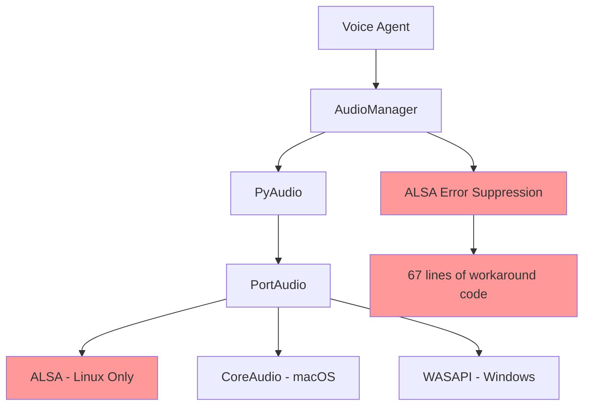
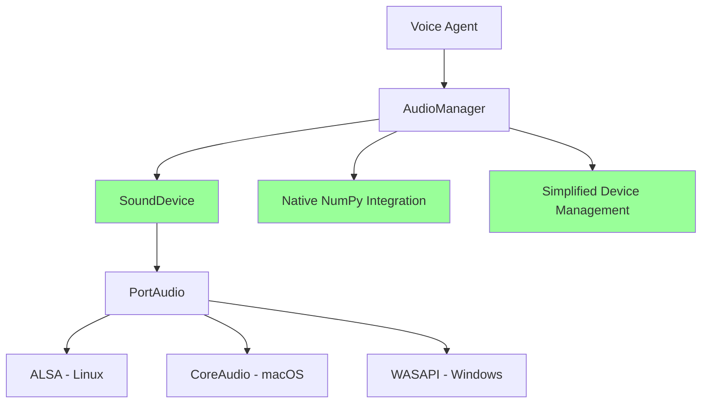

# SoundDevice Integration Plan for Voice Agent

## Overview

We'll migrate from PyAudio/ALSA to SoundDevice, eliminating platform-specific audio issues while maintaining all current functionality. This plan focuses on a clean, backward-compatible transition.

## Migration Strategy

### Phase 1: Foundation Setup

1. **Dependency Management**: Update project dependencies
2. **Configuration Updates**: Modify audio settings structure
3. **Core Audio Manager**: Refactor [`audio_manager.py`](src/voice_agent/core/audio_manager.py)

### Phase 2: Implementation

1. **Audio Input Migration**: Replace PyAudio recording with SoundDevice
2. **Audio Output Migration**: Replace PyAudio playback with SoundDevice
3. **Device Management**: Implement SoundDevice device handling
4. **Error Handling**: Remove ALSA-specific error suppression

### Phase 3: Integration & Testing

1. **Service Integration**: Update STT/TTS service interfaces
2. **Configuration Testing**: Validate cross-platform settings
3. **Performance Validation**: Verify latency and quality improvements

## Detailed Implementation Plan

### 1. Dependency Updates

#### Requirements Changes

```python
# Remove
pyaudio>=0.2.11

# Add
sounddevice>=0.4.6
```

#### System Dependencies (Nix)

```nix
# Keep (SoundDevice uses same PortAudio backend)
portaudio
alsa-utils  # Still needed on Linux, but no direct ALSA calls

# Add for better cross-platform support
pulseaudio  # Linux audio server support
```

### 2. Core Architecture Changes

#### Current Architecture Issues to Solve



#### Target Architecture



### 3. AudioManager Refactoring Plan

#### Key Changes in [`audio_manager.py`](src/voice_agent/core/audio_manager.py)

##### Remove (Lines 16-87): ALSA Error Suppression

```python
# DELETE: All ALSA-specific error handling
# - _py_alsa_error_handler()
# - _suppress_alsa_jack_errors()
# - ctypes ALSA library loading
# - Complex error context management
```

##### Replace: PyAudio Imports

```python
# Current
import pyaudio
import threading

# New
import sounddevice as sd
import numpy as np
import asyncio
```

##### Transform: Audio Stream Management

**Recording Stream Migration:**

```python
# Current PyAudio approach (lines 387-419)
def listen(self):
    with self._suppress_alsa_jack_errors():
        self.input_stream = self.pyaudio.open(
            format=pyaudio.paInt16,
            channels=1,
            rate=self.config.sample_rate,
            input=True,
            input_device_index=self.config.input_device,
            frames_per_buffer=self.config.chunk_size,
            stream_callback=self._input_callback,
        )

# New SoundDevice approach
def listen(self):
    self.input_stream = sd.InputStream(
        samplerate=self.config.sample_rate,
        channels=1,
        dtype=np.int16,
        device=self.config.input_device,
        blocksize=self.config.chunk_size,
        callback=self._input_callback,
        latency='low'
    )
```

**Playback Stream Migration:**

```python
# Current PyAudio approach (lines 535-590)
def play_audio(self, audio_data):
    with self._suppress_alsa_jack_errors():
        output_stream = self.pyaudio.open(
            format=self.pyaudio.get_format_from_width(2),
            channels=1,
            rate=sample_rate,
            output=True,
            output_device_index=self.config.output_device,
            frames_per_buffer=1024
        )

# New SoundDevice approach
def play_audio(self, audio_data):
    sd.play(
        audio_data,
        samplerate=sample_rate,
        device=self.config.output_device,
        blocking=False
    )
```

##### Enhance: Device Management

```python
# Current approach (lines 744-780)
def get_device_info(self):
    # Complex PyAudio device enumeration with workarounds

# New SoundDevice approach
def get_device_info(self):
    devices = sd.query_devices()
    return {
        'input_devices': [d for d in devices if d['max_input_channels'] > 0],
        'output_devices': [d for d in devices if d['max_output_channels'] > 0],
        'default_input': sd.default.device[0],
        'default_output': sd.default.device[1]
    }
```

### 4. Configuration Updates

#### Audio Configuration Schema [`default.yaml`](src/voice_agent/config/default.yaml)

```yaml
# Enhanced audio configuration
audio:
  sample_rate: 16000
  chunk_size: 1024
  channels: 1
  dtype: "int16" # New: explicit data type
  latency: "low" # New: latency hint for SoundDevice
  input_device: null # null = auto-detect
  output_device: null
  # VAD settings (unchanged)
  vad_aggressiveness: 3
  energy_threshold: 7000
  # New performance settings
  buffer_size: 2048 # New: internal buffer management
  enable_echo_cancellation: true # New: potential feature
```

### 5. Integration Points

#### STT Service Updates [`stt_service.py`](src/voice_agent/core/stt_service.py)

- **No changes required**: Audio data format remains numpy arrays
- **Performance improvement**: Lower latency audio delivery

#### TTS Service Updates [`tts_service.py`](src/voice_agent/core/tts_service.py)

- **No changes required**: Audio playback interface unchanged
- **Enhancement opportunity**: Async playback support

### 6. Error Handling Strategy

#### Replace Platform-Specific Error Handling

```python
# Remove: Complex ALSA error suppression (67 lines)
# Add: Clean, cross-platform error handling

def _handle_audio_error(self, error):
    """Unified error handling for all platforms"""
    if isinstance(error, sd.PortAudioError):
        # Handle PortAudio errors uniformly
        logger.warning(f"Audio error: {error}")
        return self._attempt_fallback_device()
    else:
        # Handle other audio-related errors
        logger.error(f"Unexpected audio error: {error}")
        raise
```

## Implementation Phases

### Phase 1: Preparation (Day 1)

1. **Update Dependencies**
   - Modify [`setup.py`](setup.py) and [`devenv.nix`](devenv.nix)
   - Add SoundDevice to requirements
   - Test installation across platforms

2. **Backup Current Implementation**
   - Create branch: `feature/sounddevice-migration`
   - Document current audio workflows

### Phase 2:
